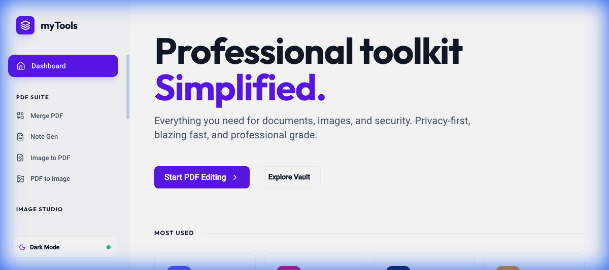
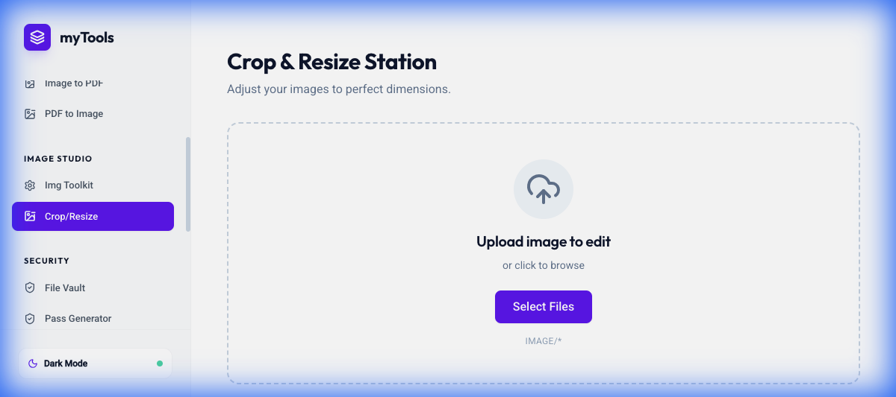
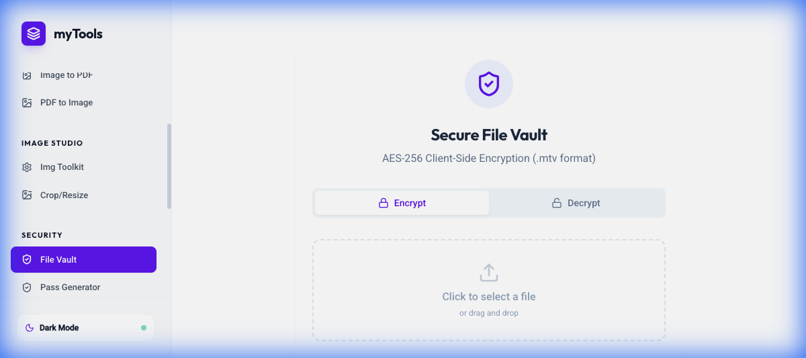

# 🛠️ omniTools: The Ultimate PDF & Image Suite


omniTools is a powerful, privacy-focused, and all-in-one web utility suite designed to handle your PDF, Image, Security, and Productivity needs entirely in the browser. No file uploads to servers, no privacy concerns.

**Live Demo:** [https://omnitoolpdfimagesuitev10.vercel.app/](https://omnitoolpdfimagesuitev10.vercel.app/#/)

---

## 🚀 Features

### 📄 PDF Power Tools
- **Image to PDF:** Convert multiple images into a single, high-quality PDF.
- **PDF to Image:** Extract pages from PDF documents as high-resolution images.
- **Merge PDF:** Combine multiple PDF files into one seamless document.
- **Note Generator:** Create beautiful PDF notes with custom formatting.

### 🖼️ Image Studio
- **Crop & Resize:** Professional-grade image editing with aspect ratio controls.
- **Format Converter:** Switch between PNG, JPG, WEBP, and more.
- **Batch Processing:** Handle multiple images at once for efficiency.

### 🔐 Security & Privacy
- **Secure Vault:** AES-256 client-side encryption for your sensitive files.
- **Password Manager:** Securely generate and store your credentials.
- **Hash Generator:** Calculate MD5, SHA-1, SHA-256, and SHA-512 hashes.
- **Password Tool:** Analyze password strength and generate secure alternatives.

### ⚡ Productivity & Web Tools
- **QR Code Suite:** Generate individual or batch QR codes for URLs, text, and more.
- **Text Formatter:** Clean, transform, and format text instantly.
- **Markdown Preview:** Real-time markdown editor and renderer.
- **Typing Test:** Boost your productivity with a built-in typing speed trainer.

---

## 📸 Screenshots

<p align="center">
  
  
</p>
<p align="center">
  
  
</p>

---

## 🛠️ Tech Stack

- **Frontend:** React 19, Vite, TypeScript
- **Styling:** Tailwind CSS, Framer Motion (Animations)
- **PDF Processing:** jsPDF, PDF-Lib
- **Image Processing:** Sharp, React Image Crop
- **Security:** Crypto-JS (AES-256)
- **Deployment:** Vercel

---

## 📦 Installation & Setup

1. **Clone the repository:**
   ```bash
   git clone https://github.com/ahmed0004321/omnitool---pdf--image-suite.git
   ```
2. **Install dependencies:**
   ```bash
   npm install
   ```
3. **Run the development server:**
   ```bash
   npm run dev
   ```
4. **Build for production:**
   ```bash
   npm run build
   ```

---

## 🤝 Contributing

Contributions are welcome! Please feel free to submit a Pull Request.

## 📄 License

This project is licensed under the MIT License - see the [LICENSE](LICENSE) file for details.

---

<p align="center">Built with ❤️ by <a href="https://github.com/ahmed0004321">Ahmed</a></p>
